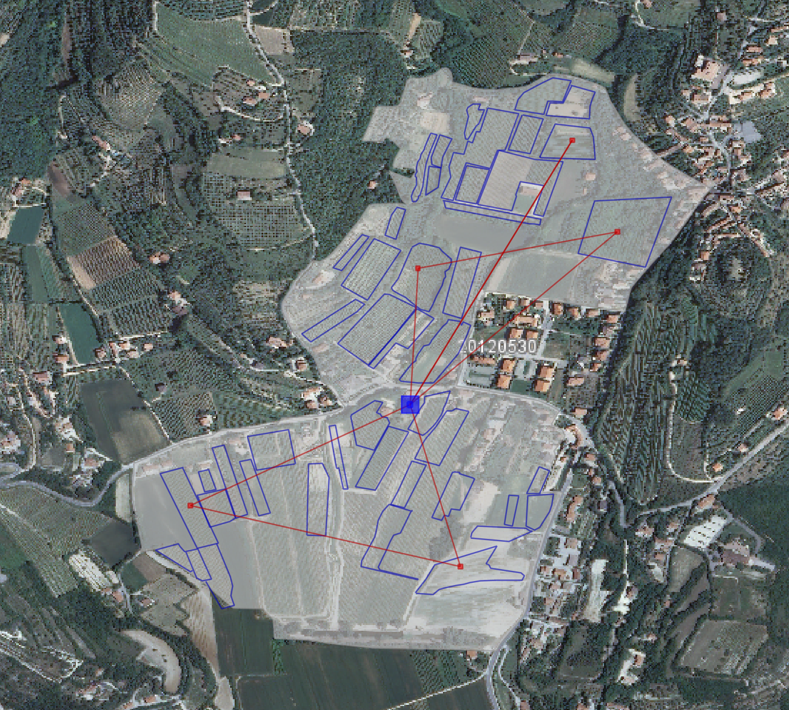
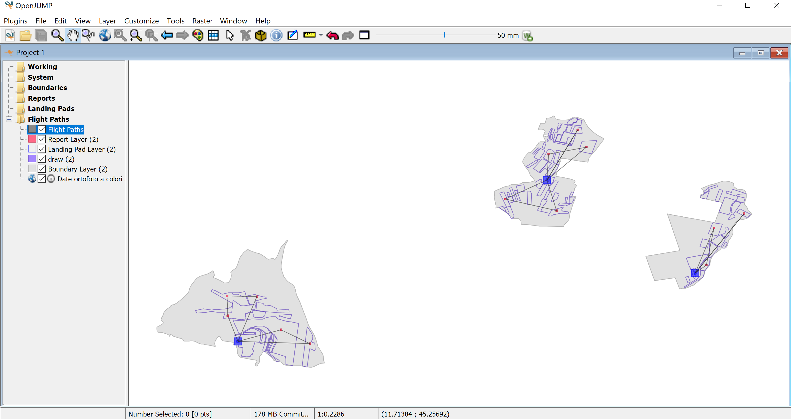

# VineDiseases

## Overview
The OpenJUMP Vine Disease Detection Plugin is a specialized tool designed to streamline the process of monitoring and managing vineyard health through the use of drone technology. This plugin integrates seamlessly with the OpenJUMP GIS platform, enabling users to effectively plan and execute drone flights for the purpose of vine disease detection. By leveraging spatial data and advanced algorithmic processing, the plugin facilitates precise flight path computations, ensuring comprehensive coverage of vineyard areas while adhering to operational constraints such as battery life.


## Key Features
- **Flight Path Planning**: Automatically calculates optimal flight paths for drones, enabling them to inspect vineyards for disease signs efficiently. The plugin accounts for battery limitations, ensuring that drones can cover the necessary ground without the risk of power depletion.
- **Spatial Data Integration**: Utilizes spatial data layers, including vineyard boundaries, extensions, landing pads, and disease report locations, to inform flight path calculations and mission planning.
- **Layer Visualization**: Displays computed flight paths as a new layer within the OpenJUMP interface, providing users with a clear visualization of the drone's planned route.
- **Battery Management**: Implements an intelligent algorithm to manage drone battery life, splitting longer flight paths into shorter segments that ensure the drone can return to its landing pad without running out of power.
- **User-Friendly Interface**: Features an intuitive user interface for loading and selecting the necessary shapefile layers, simplifying the process of setting up a disease detection mission.

## Dependencies
- Jump Workbench
- JTS (Java Topology Suite)

## Getting Started
1. Install JUMP GIS software.
2. Run the project and navigate to "Plugins" in OpenJump.
3. Select "Vine Disease Detection" > "Load Layers" and load the required shapefiles:
   - Boundary Layer File
   - Extensions of the Vineyards' Layer File
   - Report Layer File
   - Landing Pad Layer File
   Ensure the CRS of these layers is set to EPSG:4326.
4. The plugin processes the shapefiles and generates a new layer for flight paths.
5. Upon completion, "droneActions.txt" is generated in the Output directory, logging the drone's actions.
6. To open the WMS map layer of Italy follows these steps:
In OpenJump, right-click on one of the folders, and select "Open..."
Choose "WMSlayer" and enter the following URL: "http://wms.pcn.minambiente.it/ogc?map=/ms_ogc/WMS_v1.3/raster/ortofoto_colore_12.map"
Click "Next," then "Add All."
Ensure that the CRS is set to EPSG:4326.
Finally, click "Finish."

## User Interface
The plugin prompts the user to select four Shapefile layers through a dialog:
- Boundary, extensions, reports, and landing pad layers.

```java
    @Override
    public boolean execute(PlugInContext context) throws Exception {
      // ... Main execution logic ...
    }
 
    @Override
    public void initialize(PlugInContext context) throws Exception {
      // ... Adding the plugin to the menu ...
    }
 
      // Loading layers, Call computeFlightPaths, and create a layer for the flight paths
    @Override
    public void actionPerformed(ActionEvent e) {
      // ...
    }
 
    // Prompt the user to select a file (*.shp)
    private File promptForFile(PlugInContext context, String title) {
      // ...
    }
```

## Algorithm Overview
The core algorithm underpinning the Vine Disease Detection Plugin is designed for efficiency and accuracy. It involves spatial indexing to quickly locate reports within proximity to each landing pad and calculates flight paths that respect the drone's battery limitations. The algorithm ensures that all areas of interest are covered, prioritizing reports based on their location and the drone's remaining battery life. The process is highly automated, requiring minimal user intervention once the initial parameters are set.


## Use Case
The plugin is particularly useful for vineyard managers and agricultural professionals seeking to leverage drone technology for the early detection of vine diseases. By automating the process of flight path calculation and optimizing for battery life, the plugin significantly reduces the time and effort required to monitor large vineyard areas, enabling more frequent and thorough inspections.

## Output
The OpenJUMP Vine Disease Detection Plugin provides essential outputs to facilitate vineyard monitoring and management. These outputs include:

- **Flight Paths**: The plugin generates layers illustrating the drone's flight paths between landing pads and report locations, ensuring comprehensive coverage of the vineyard.
- **Drone Actions Log**: A log file named "droneActions.txt" details the drone's journey, including movements, actions, and battery levels, aiding in mission analysis and optimization.
- **Updated Layers**: Successful flight path computations result in the addition of new layers within OpenJUMP, showcasing boundaries, extensions, reports, landing pads, and the computed flight paths for easy visualization and further analysis.
    
## Example Drone's Action Log
Drone's actions:
```
Checked landing pad 0 :(11.68057377487453, 45.25017596562708, NaN)
**Moved from Landing pad to report: 1**
[Remaining battery: 1708.689616649285]
[Total distance till now: 291.31038335071503]
**Visited Report 2: (11.679515587541049, 45.25463588008391, NaN)**
[Remaining battery: 1493.723355973568]
[Total distance till now: 506.276644026432]
**Visited Report 3: (11.682447027147106, 45.25457502521913, NaN)**
[Remaining battery: 1264.1607188944158]
[Total distance till now: 735.8392811055841]

A path got created!
```

